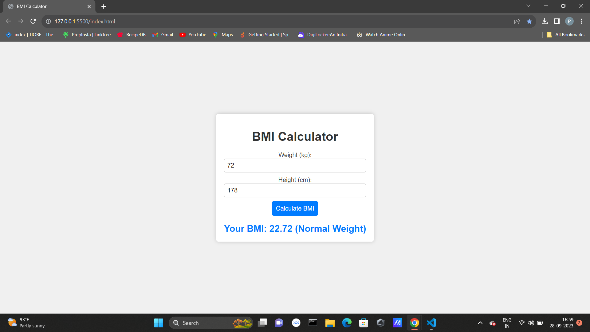

# BMI Calculator

This is a simple BMI (Body Mass Index) calculator web application. It helps users calculate their BMI based on their weight (in kilograms) and height (in centimeters). The application provides a BMI category, indicating whether the user is underweight, of normal weight, overweight, or obese.

## Features

- Input fields for weight and height.
- Calculate BMI based on user input.
- Display BMI category.
- Error message for invalid inputs.

## Tools and Languages Used

- HTML
- CSS
- JavaScript

## How to Use

1. Enter your weight in kilograms in the "Weight (kg)" input field.
2. Enter your height in centimeters in the "Height (cm)" input field.
3. Click the "Calculate BMI" button.
4. Your BMI and category will be displayed below.

## Screenshots

## License

This project is licensed under the MIT License - see the [LICENSE](LICENSE) file for details.
